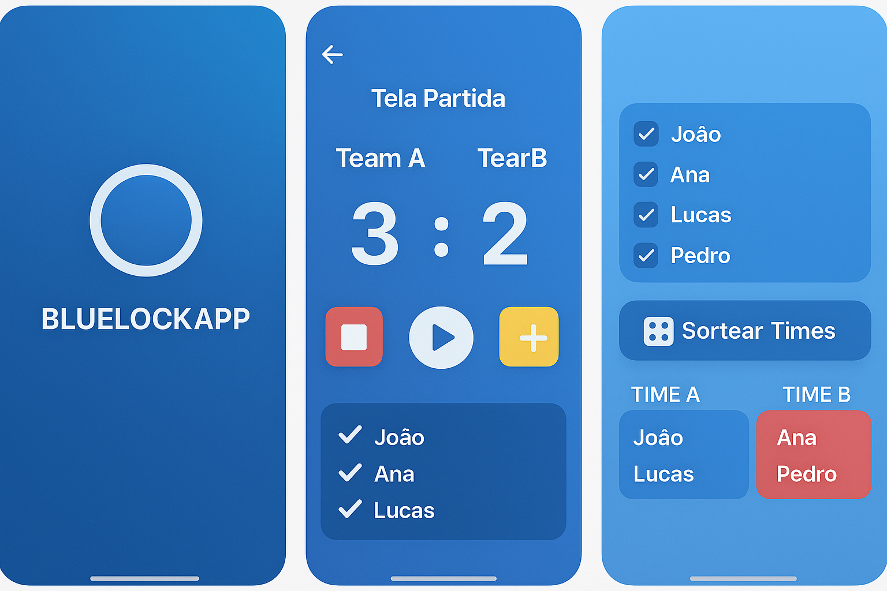

# BLUE LOCK PROJECT: App para gerenciamento de partidas

## Projeto
- Feito em react native com expo
## Funcionalidades
- cronometrar o tempo.
- gerenciar o placar de forma eficiente.
- gerenciar cartões.
- gerar times aleatorios a partir de uma lista de jogadores.

## Modelo da tela v 1.0 (Gerado pelo chatgpt)

